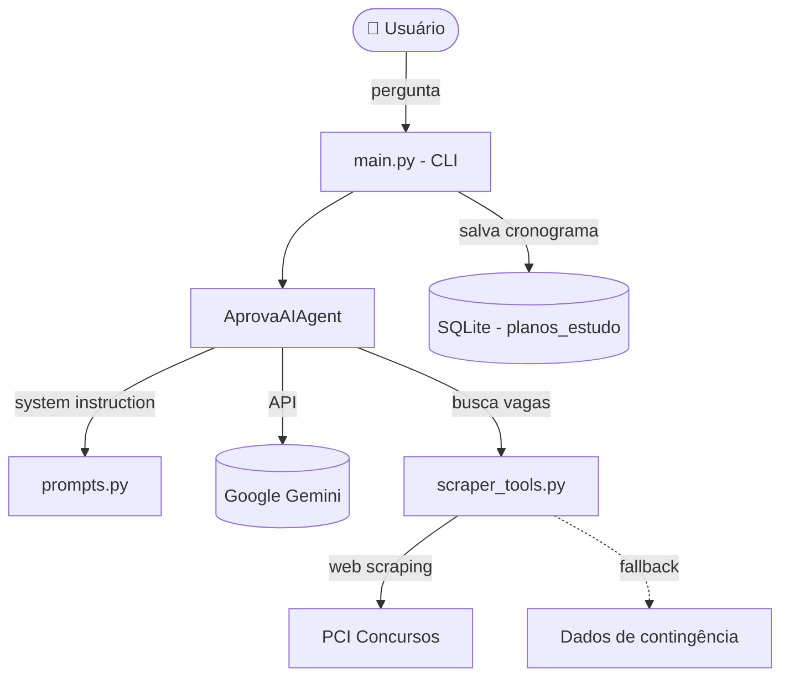

# 🤖 AprovaAI — Mentor de Estudos com IA para Concursos de TI


Agente de inteligência artificial que atua como mentor estratégico para concursos
públicos da área de Tecnologia da Informação. Ele analisa vagas, identifica a banca
organizadora e gera cronogramas de estudo personalizados em formato de tabela.

## ✨ Funcionalidades

- 💬 **Chat com IA** via Google Gemini (`gemini-2.5-flash`)
- 🔎 **Busca de vagas** de concursos de TI por web scraping, com *fallback* de contingência caso o portal bloqueie a requisição
- 🧠 **Estratégia por banca** (CEBRASPE, FGV, FCC) com ajuste do peso das matérias
- 📅 **Cronogramas** entregues em tabela Markdown (teoria, prática e revisão)
- 💾 **Histórico** de planos de estudo salvos em banco SQLite local

## 🛠️ Tecnologias

- Python 3.12
- [Google GenAI SDK](https://pypi.org/project/google-genai/) (Gemini)
- BeautifulSoup4 + Requests (web scraping)
- SQLite
- python-dotenv

## 📂 Estrutura do projeto

```
concurso_agent_ai/
├── config/
│   └── settings.py        # Configurações (modelo, temperatura, chaves)
├── src/
│   ├── agents/
│   │   ├── mentor_agent.py # Agente AprovaAI (Gemini)
│   │   └── prompts.py      # System instruction / personalidade
│   ├── tools/
│   │   └── scraper_tools.py # Busca de vagas de concursos
│   ├── database/
│   │   └── connection.py    # Conexão e schema SQLite
│   └── main.py              # Ponto de entrada (CLI)
└── tests/                   # Testes do scraper e do agente
```

## 🏗️ Arquitetura



**Fluxo:** o usuário interage via CLI → o agente monta o contexto com a *system instruction*
(personalidade + estratégia por banca) → consulta o Gemini e, quando necessário, a ferramenta
de scraping de vagas → cronogramas gerados podem ser persistidos no SQLite.

## 🚀 Como executar

```bash
# 1. Clone o repositório
git clone https://github.com/toni0709/concurso_agent_ai.git
cd concurso_agent_ai

# 2. Crie e ative o ambiente virtual
python -m venv venv
source venv/bin/activate    # Windows: venv\Scripts\activate

# 3. Instale as dependências
pip install -r requirements.txt

# 4. Configure sua chave da API
cp .env.example .env        # depois edite o .env e coloque sua GEMINI_API_KEY

# 5. Rode o agente
python src/main.py
```

> A chave da API do Gemini pode ser gerada gratuitamente no [Google AI Studio](https://aistudio.google.com/).

## 💡 Exemplo de uso

```
Você 👤: Quero ver vagas de concurso para desenvolvedor

Pensando... 🧠

AprovaAI 🤖:
Encontrei oportunidades na área de TI. Para o SERPRO (banca CEBRASPE),
recomendo o seguinte cronograma estratégico...
```

## 📝 Licença

Distribuído sob a licença MIT. Veja o arquivo [LICENSE](LICENSE) para mais detalhes.
