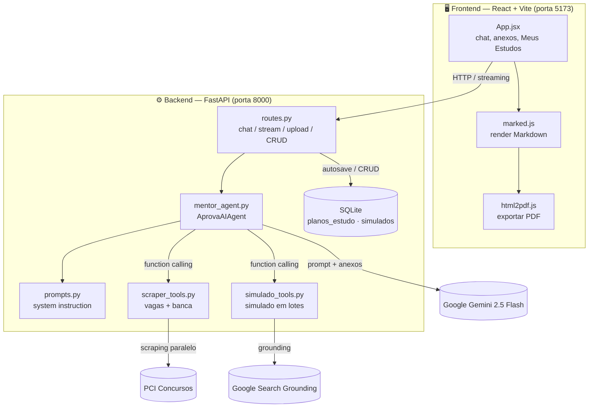

# 🤖 AprovaAI — Mentor de Estudos com IA para Concursos de TI


**AprovaAI** é um assistente de estudos com Inteligência Artificial construído para candidatos
a concursos públicos da área de **Tecnologia da Informação**. Ele conversa com o usuário, busca
**vagas reais em tempo real**, identifica a **banca organizadora** de cada concurso, lê **editais
em PDF/imagem**, monta **cronogramas de estudo personalizados por banca** e gera **simulados com
gabarito comentado** fundamentados em provas anteriores reais — tudo com uma interface web moderna
e respostas em *streaming*.

> Projeto full-stack (Python/FastAPI + React) que demonstra integração com LLM, *function calling*,
> *tool use*, RAG via *grounding* de busca, web scraping resiliente, streaming HTTP e UX de produto.

---

## 📑 Índice

- [Principais funcionalidades](#-principais-funcionalidades)
- [Demonstração do fluxo](#-demonstração-do-fluxo)
- [Arquitetura](#️-arquitetura)
- [Stack de tecnologias](#️-stack-de-tecnologias)
- [Estrutura do projeto](#-estrutura-do-projeto)
- [Como a IA funciona por dentro](#-como-a-ia-funciona-por-dentro)
- [API (endpoints)](#-api-endpoints)
- [Banco de dados](#️-banco-de-dados)
- [Como executar](#-como-executar)
- [Testes](#-testes)
- [Decisões de engenharia](#-decisões-de-engenharia)
- [Competências demonstradas](#-competências-demonstradas)
- [Roadmap](#-roadmap)
- [Licença](#-licença)

---

## ✨ Principais funcionalidades

| Funcionalidade | Descrição |
| --- | --- |
| 💬 **Chat com IA** | Conversa em linguagem natural com o mentor, movido pelo Google Gemini `2.5-flash`. |
| ⚡ **Respostas em streaming** | O texto aparece token a token (`StreamingResponse` + `fetch` streaming), reduzindo a espera percebida em respostas longas. |
| 🔎 **Vagas de TI em tempo real** | Web scraping do portal PCI Concursos, filtrando **apenas vagas de TI** com *regex* por fronteira de palavra. |
| 🏛️ **Detecção automática de banca** | Para cada vaga, o sistema abre a página de detalhe e extrai a **banca organizadora** (CEBRASPE, FGV, FCC etc.) em **paralelo** (`ThreadPoolExecutor`). |
| 📅 **Cronograma personalizado por banca** | Planos táticos em tabela Markdown (teoria, prática e revisão), ajustados ao estilo da banca identificada. |
| 📄 **Leitura de editais (multimodal)** | Envie um **edital em PDF ou imagem**; o agente extrai órgão, cargo, banca e conteúdo programático **do próprio documento** e monta o plano com base no programa real. |
| 📝 **Simulados com gabarito comentado** | Gera dezenas (até 100+) de questões no estilo da banca, fundamentadas em **provas anteriores reais** via *Google Search grounding*, com **gabarito e comentário destacados em verde**. |
| 📚 **Aba "Meus Estudos"** | Histórico de todos os planos e simulados gerados, com opção de **exportar** e **apagar** (individual ou tudo). |
| ⬇️ **Exportação** | Baixe qualquer plano ou simulado em **Markdown (.md)** ou **PDF** (tema claro, tabelas e gabaritos formatados). |
| 🔗 **Links seguros** | Todos os links de vagas abrem em nova aba com `rel="noopener noreferrer"`. |

---

## 🎬 Demonstração do fluxo

```text
Usuário: Quais vagas de TI estão abertas agora?
AprovaAI: 🔎 Encontrei 12 concursos de TI em aberto (com a banca de cada um)...
          1. TRE-XX — Analista Judiciário / TI — Banca: FGV — [link]
          2. Prefeitura de ... — Analista de Sistemas — Banca: CEBRASPE — [link]
          ...
          Para qual deles você quer montar o plano de estudos?

Usuário: Faz o plano da vaga 1.
AprovaAI: (gera cronograma tático em tabela, ajustado ao estilo FGV)
          Quer que eu gere um simulado com gabarito comentado dessa vaga?

Usuário: Sim, com muitas questões.
AprovaAI: (pesquisa provas anteriores reais da FGV e devolve 80 questões
           comentadas — salvas automaticamente em "Meus Estudos")
```

Também é possível **anexar um edital em PDF** e pedir "monte meu plano com base neste edital" —
o agente lê o documento e usa o conteúdo programático real.

---

## 🏗️ Arquitetura



**Resumo do fluxo:** o React envia a mensagem (e anexos) para a FastAPI → o `AprovaAIAgent` monta
o contexto com a *system instruction* e decide, via **function calling**, se chama o scraper de vagas
ou o gerador de simulados → o Gemini produz a resposta (em *streaming*) → planos são **auto-salvos**
no SQLite quando detectados → o frontend renderiza o Markdown e oferece exportação.

---

## 🛠️ Stack de tecnologias

**Backend**
- **Python 3.12**
- **FastAPI** + **Uvicorn** — API assíncrona e servidor ASGI
- **Google GenAI SDK** (`google-genai`) — Gemini `2.5-flash`, *function calling* e *grounding*
- **BeautifulSoup4** + **Requests** — web scraping
- **SQLite** — persistência local
- **python-dotenv** — configuração via `.env`
- **pytest** — testes automatizados

**Frontend**
- **React 19** + **Vite 8**
- **marked** — renderização de Markdown
- **html2pdf.js** — exportação para PDF
- CSS próprio (tema escuro, sem framework de UI)

---

## 📂 Estrutura do projeto

```text
AprovaAI/
├── config/
│   └── settings.py            # Modelo, temperatura, chave e nome do banco
├── src/
│   ├── main.py                # App FastAPI: CORS, lifespan, rotas
│   ├── api/
│   │   └── routes.py          # Endpoints: chat, streaming, upload, CRUD de estudos, autosave
│   ├── agents/
│   │   ├── mentor_agent.py    # AprovaAIAgent (chat, streaming, multimodal, tools)
│   │   └── prompts.py         # System instruction (personalidade + fluxos de trabalho)
│   ├── tools/
│   │   ├── scraper_tools.py   # Busca de vagas de TI + extração paralela da banca
│   │   └── simulado_tools.py  # Geração de simulado em lotes com grounding
│   └── database/
│       └── connection.py      # Conexão SQLite + criação das tabelas
├── aprova-ai-web/             # Frontend React + Vite
│   ├── src/App.jsx            # Componente principal (chat, anexos, Meus Estudos, exportação)
│   └── src/index.css          # Estilos (tema escuro, gabarito verde, cards)
├── tests/                     # Testes de scraper e banco (rede e API mockadas)
├── requirements.txt           # Dependências do backend
├── start.sh                   # Sobe backend + frontend juntos
├── start_backend.sh           # Sobe apenas o backend
└── .env.example               # Modelo de variáveis de ambiente
```

---

## 🧠 Como a IA funciona por dentro

O agente é definido em `mentor_agent.py` e usa **function calling automático** do Gemini. Duas
ferramentas Python são registradas e o modelo decide quando chamá-las:

```python
self.config = types.GenerateContentConfig(
    system_instruction=SYSTEM_INSTRUCTION,
    temperature=settings.TEMPERATURE,
    tools=[buscar_vagas_concurso, gerar_simulado],
    automatic_function_calling=types.AutomaticFunctionCallingConfig(disable=False),
)
```

- **`buscar_vagas_concurso(area_interesse)`** — faz scraping do PCI Concursos, filtra vagas de TI e,
  para cada uma, abre a página de detalhe e extrai a banca em **duas etapas**: (1) busca por bancas
  conhecidas e (2) *regex* de frases-pista como *"a organização caberá à ..."*. As buscas de banca
  rodam em **paralelo** com `ThreadPoolExecutor` para manter a resposta rápida.
- **`gerar_simulado(concurso, banca, conteudo_programatico, quantidade_questoes)`** — gera o simulado
  em **lotes de 20 questões** (evita truncamento de saída), cada lote usando **Google Search grounding**
  para se basear em provas anteriores reais. O gabarito e o comentário são emitidos em *blockquote*
  padronizado, o que permite destacá-los em **verde** no frontend e no PDF.

O comportamento (personalidade, estratégia por banca, fluxos de vaga→plano e edital→plano) é todo
guiado pela *system instruction* em `prompts.py`.

**Entrada multimodal:** quando o usuário anexa um edital, os bytes do arquivo viram `types.Part`
e são enviados ao modelo junto do texto, permitindo que o agente leia o documento diretamente.

---

## 🌐 API (endpoints)

Base URL: `http://localhost:8000` — documentação interativa (Swagger) em `/docs`.

| Método | Rota | Descrição |
| --- | --- | --- |
| `GET` | `/` | Status da API |
| `POST` | `/api/chat` | Chat (texto), resposta completa |
| `POST` | `/api/chat-arquivo` | Chat com anexos (PDF/imagem) |
| `POST` | `/api/chat-stream` | Chat (texto) em **streaming** |
| `POST` | `/api/chat-arquivo-stream` | Chat com anexos em **streaming** |
| `POST` | `/api/plano/salvar` | Salva um plano manualmente |
| `GET` | `/api/planos` | Lista os planos salvos |
| `DELETE` | `/api/planos/{id}` | Apaga um plano |
| `DELETE` | `/api/planos` | Apaga **todos** os planos |
| `GET` | `/api/simulados` | Lista os simulados salvos |
| `DELETE` | `/api/simulados/{id}` | Apaga um simulado |
| `DELETE` | `/api/simulados` | Apaga **todos** os simulados |

Validações: tipos de anexo aceitos (`PDF, PNG, JPG, WEBP, GIF`) e limite de **15 MB** por arquivo.

---

## 🗄️ Banco de dados

SQLite local (`aprova_ai.db`), criado automaticamente na inicialização (`inicializar_banco`).

```sql
CREATE TABLE planos_estudo (
    id         INTEGER PRIMARY KEY AUTOINCREMENT,
    concurso   TEXT NOT NULL,
    banca      TEXT NOT NULL,
    cronograma TEXT NOT NULL,
    criado_em  TIMESTAMP DEFAULT CURRENT_TIMESTAMP
);

CREATE TABLE simulados (
    id        INTEGER PRIMARY KEY AUTOINCREMENT,
    concurso  TEXT NOT NULL,
    banca     TEXT NOT NULL,
    conteudo  TEXT NOT NULL,
    criado_em TIMESTAMP DEFAULT CURRENT_TIMESTAMP
);
```

Um plano é **auto-salvo** apenas quando a resposta realmente parece um cronograma (heurística que
exige tabela Markdown ou múltiplas semanas), evitando salvar listagens de vagas por engano.

---

## 🚀 Como executar

### Pré-requisitos
- Python 3.12+
- Node.js 18+
- Uma chave do **Google Gemini** (gratuita no [Google AI Studio](https://aistudio.google.com/))

### 1. Clonar e configurar o backend

```bash
git clone https://github.com/ToniLima87/AprovaAI.git
cd AprovaAI

python -m venv venv
source venv/bin/activate        # Windows: venv\Scripts\activate
pip install -r requirements.txt

cp .env.example .env            # edite o .env e cole a sua GEMINI_API_KEY
```

### 2. Instalar o frontend

```bash
cd aprova-ai-web
npm install
cd ..
```

### 3. Rodar tudo de uma vez

```bash
./start.sh
```

- Frontend: **http://localhost:5173**
- Backend: **http://localhost:8000** (docs em `/docs`)

> Prefere separar? Use `./start_backend.sh` para o backend e, em outro terminal,
> `cd aprova-ai-web && npm run dev` para o frontend.

---

## 🧪 Testes

Os testes usam **pytest** com rede e API **mockadas** — não precisam de internet nem de chave:

```bash
pytest -v
```

Cobrem o scraper de vagas (parsing e tratamento de erros) e a camada de banco SQLite.

---

## 🧩 Decisões de engenharia

- **Separação de responsabilidades** — agente, ferramentas, rotas, banco e configuração ficam em
  módulos isolados, facilitando manutenção e testes.
- **Geração em lotes para simulados grandes** — em vez de uma única chamada (sujeita a truncamento),
  o simulado é montado em blocos de 20 questões, permitindo 100+ questões de forma confiável.
- **Streaming de ponta a ponta** — o backend usa `StreamingResponse` e o frontend consome o corpo
  em pedaços; o Markdown só é renderizado ao final, evitando "quebras" visuais durante o streaming.
- **Scraping resiliente e honesto** — se o portal mudar de layout ou ficar indisponível, o sistema
  responde de forma transparente em vez de inventar dados.
- **Grounding para veracidade** — os simulados se apoiam em provas reais via Google Search, reduzindo
  alucinação e aumentando a relevância das questões.
- **Segurança de segredos** — a chave da API vive em `.env` (git-ignored); o repositório traz apenas
  o `.env.example`.

---

## 💼 Competências demonstradas

Este projeto evidencia, na prática:

- Integração com **LLM** (Google Gemini): *function calling*, *tool use*, entrada **multimodal** e *grounding*.
- Desenvolvimento **full-stack**: API **FastAPI** assíncrona + SPA em **React/Vite**.
- **Streaming HTTP** e otimização de UX percebida.
- **Web scraping** com parsing resiliente e **concorrência** (`ThreadPoolExecutor`).
- Modelagem e **persistência** de dados (SQLite) com operações **CRUD**.
- **Engenharia de prompts** para orquestrar fluxos de trabalho complexos.
- Boas práticas: testes automatizados, gestão de segredos, código modular e documentado.

---

## 🗺️ Roadmap

- [ ] Autenticação de usuários e histórico por conta
- [ ] Deploy (backend em container + frontend estático)
- [ ] Acompanhamento de progresso e revisão espaçada
- [ ] Exportar simulado em formato de prova (sem gabarito) para treino cronometrado

---

## 📝 Licença

Distribuído sob a licença **MIT**. Veja o arquivo [LICENSE](LICENSE) para mais detalhes.

---

<p align="center">Feito com ☕ e Python para ajudar quem estuda para concursos de TI.</p>
